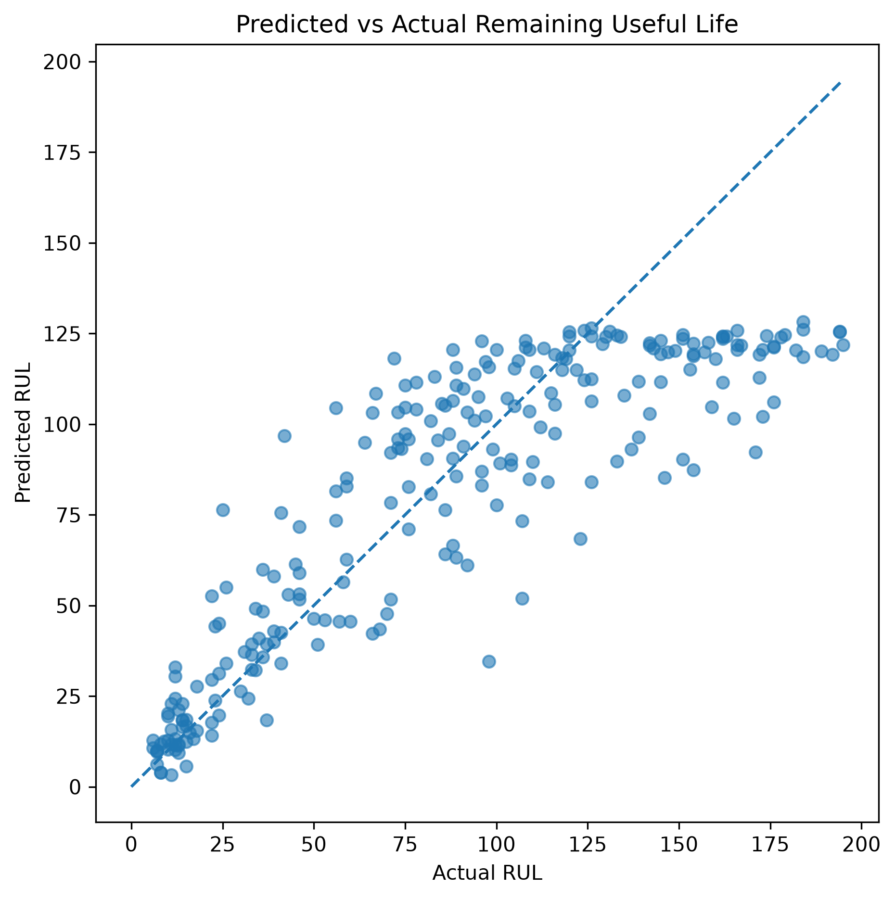
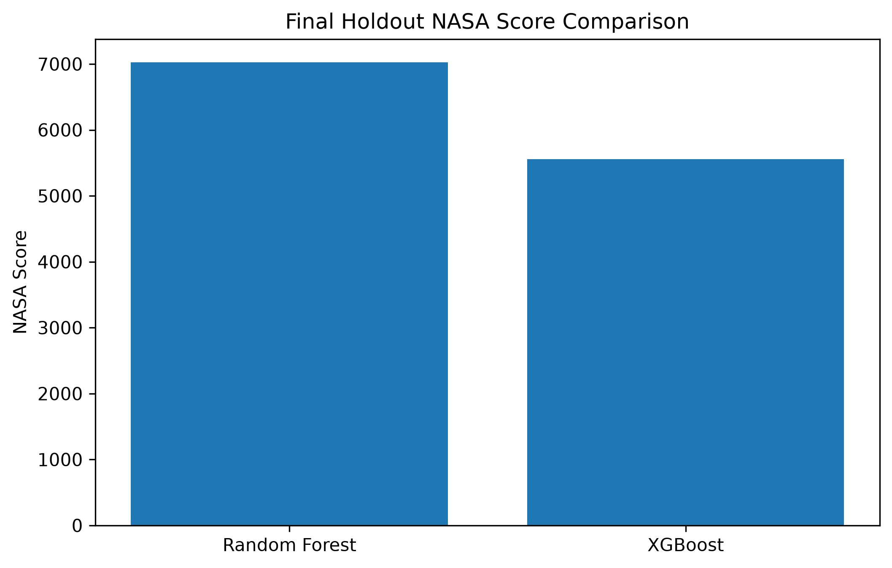

# Remaining Useful Life Prediction for Industrial Equipment (NASA CMAPSS FD004)

## Project Overview

This project develops an industrial machine learning pipeline for Remaining Useful Life (RUL) prediction using the NASA CMAPSS turbofan engine degradation dataset.

Unlike traditional predictive maintenance systems that only predict failure or no-failure, this project estimates the number of operating cycles remaining before an engine reaches failure conditions. Accurate RUL estimation allows maintenance teams to schedule repairs proactively, reduce downtime, optimize spare part logistics, and improve operational safety.

The project was developed as an end-to-end ML engineering project with an emphasis on industrial best practices, reproducibility, explainability, and deployment readiness.

---

## Business Motivation

Predicting RUL provides significantly more value than binary fault prediction because maintenance decisions require planning horizons rather than simple alarms.

### Underestimation of RUL

* Premature maintenance
* Increased operational cost
* Under-utilization of expensive assets

### Overestimation of RUL

* Unexpected failures
* Unplanned downtime
* Safety risks
* Expensive emergency maintenance

In safety-critical industries such as aviation, overestimation errors are significantly more costly than underestimation errors. This is reflected in the custom **NASA scoring function** used for evaluation (see below), which penalizes overestimation more heavily than underestimation.

---

## Dataset

Dataset: NASA CMAPSS Turbofan Engine Degradation Simulation Dataset

Subset used:

* FD004

Characteristics:

* 249 training engines
* 248 testing engines
* Multiple operating conditions
* Multiple fault modes
* Variable degradation trajectories

FD004 is widely regarded as the most challenging subset due to regime switching and complex degradation behavior.

**Citation:** A. Saxena, K. Goebel, D. Simon, and N. Eklund, "Damage Propagation Modeling for Aircraft Engine Run-to-Failure Simulation," in *Proceedings of the International Conference on Prognostics and Health Management (PHM08)*, Denver, CO, 2008. Dataset available via the [NASA Prognostics Center of Excellence Data Repository](https://www.nasa.gov/intelligent-systems-division/discovery-and-systems-health/pcoe/pcoe-data-set-repository/).

---

## Setup & Reproduction

```bash
git clone <repo-url>
cd remaining-useful-life-prediction
python -m venv venv
source venv/bin/activate   # Windows: venv\Scripts\activate
pip install -r requirements.txt
```

Place the raw CMAPSS files (`train_FD004.txt`, `test_FD004.txt`, `RUL_FD004.txt`) in `data/`, then run the notebook(s) in `notebooks/` top to bottom. Random seeds are fixed (`SEED = 42`) for `numpy`, `random`, and all scikit-learn / XGBoost estimators to keep results reproducible across runs. Package versions are pinned in `requirements.txt`; tree-based model outputs can shift slightly across scikit-learn/XGBoost versions even with the same seed, so matching those versions matters for exact reproduction.

---

## Project Pipeline

### 1. Exploratory Data Analysis

* Engine lifetime distribution analysis
* Sensor variance analysis
* Degradation trend visualization
* Operating regime analysis

### 2. Feature Engineering

* RUL target generation
* RUL clipping at 125 cycles
* Rolling mean features
* Rolling standard deviation features
* Lag features
* Temporal delta features
* Operating regime clustering using KMeans

Rolling/lag/delta features are computed per-engine (grouped by `engine_id`) so no information crosses between different engines' trajectories.

### 3. Validation Strategy

To prevent temporal leakage, GroupKFold cross-validation was performed using engine IDs as grouping variables.

This ensures the model is evaluated on completely unseen engines rather than unseen cycles from previously observed engines.

### 4. Models Evaluated

* Linear Regression
* Ridge Regression
* Gradient Boosting Regressor
* HistGradientBoosting Regressor
* Random Forest Regressor
* XGBoost Regressor

### 5. Hyperparameter Optimization

RandomizedSearchCV was used to optimize tree-based models while maintaining group-aware validation, scored directly against the NASA score (see below) rather than plain MAE, so hyperparameter selection is aligned with the project's asymmetric business cost.

Tuning improved XGBoost across every metric but did not improve Random Forest on this dataset (see Results below) — both outcomes are reported rather than only the favorable one.

### 6. Explainability

Model interpretability was investigated using:

* Feature Importance
* Permutation Importance
* SHAP Values

All interpretability results are generated from the final, deployed model (trained on the full feature set including operating-regime clusters) so the plots below accurately reflect what's shipped.

---

## Evaluation Metric: NASA Score

Alongside standard regression metrics (MAE, RMSE, R²), this project reports the official **NASA scoring function** used in CMAPSS prognostics literature:

* For each prediction error `d = predicted_RUL - true_RUL`:
  * If `d < 0` (underestimate — predicting failure earlier than it actually occurs): `score = exp(-d / 13) - 1`
  * If `d >= 0` (overestimate — predicting more life than the engine actually has): `score = exp(d / 10) - 1`
* The total score is the sum across all test engines.

Because the exponential penalty grows faster for overestimation than underestimation, a **lower NASA score is better**, and the metric directly encodes the safety-critical asymmetry described in the Business Motivation section — it penalizes a model that's dangerously overconfident about remaining life much more than one that's conservatively cautious.

---

## Final Holdout Results (Official NASA Test Set)

| Model         |       MAE |      RMSE |        R² | NASA Score |
| ------------- | --------: | --------: | --------: | ---------: |
| Random Forest (tuned) |     22.30 |     29.78 |     0.702 |       7026 |
| XGBoost (tuned)       | **21.01** | **28.41** | **0.729** |   **5553** |

The tuned XGBoost model achieved the best performance across all evaluation metrics and was selected as the final deployment candidate.

### Tuned vs. Untuned: an honest comparison

Hyperparameter tuning was evaluated against the original default-parameter models on the same holdout set:

| Model | | MAE | RMSE | R² | NASA |
| --- | --- | ---: | ---: | ---: | ---: |
| Random Forest | Untuned | 21.60 | 29.18 | 0.714 | 6568 |
| | **Tuned** | 22.30 | 29.78 | 0.702 | 7026 |
| XGBoost | Untuned | 21.23 | 28.65 | 0.724 | 5734 |
| | **Tuned** | **21.01** | **28.41** | **0.729** | **5553** |

Tuning **improved XGBoost across every metric** (the model actually deployed) but **did not improve Random Forest** with the search grid used here — RF's default settings already performed near-optimally, and the constrained grid (kept small deliberately for tractable runtime) may not have covered the region where further RF gains exist. Since Random Forest is not the deployed model, this doesn't affect production performance, but it's reported here rather than omitted, since a fair evaluation should show where tuning didn't help as well as where it did.

### Results Interpretation

An MAE of ~21 cycles means predictions are, on average, within about 21 operating cycles of the true remaining life. For engines in FD004 with lifespans roughly in the 130–540 cycle range, this corresponds to being off by a few percent to (in the worst, short-lifespan cases) a more significant fraction of the engine's remaining life — which is why the NASA score, not MAE alone, is used to select the final model: it penalizes the dangerous direction of error (overestimating remaining life) more heavily, which matters more for maintenance scheduling than the raw average miss distance.

---

## Final Model

XGBoost Regressor (tuned via GroupKFold-validated `RandomizedSearchCV`, scored against the NASA score)

Hyperparameters:

* n_estimators = 500
* max_depth = 6
* learning_rate = 0.03
* subsample = 0.8
* colsample_bytree = 1.0
* min_child_weight = 5

---

## Limitations

* Sensor values are not currently normalized per operating regime. Because FD004 mixes six distinct operating regimes, the same raw sensor reading can mean different things depending on the regime the engine is in at that cycle — per-regime normalization is a well-established improvement for FD002/FD004-style datasets and is a likely source of residual error, especially for long-horizon (high true-RUL) predictions where degradation signal is weakest.
* Only two sensors (`sensor_11`, `sensor_14`) are used for rolling/lag/delta feature engineering; correlation analysis in the EDA step suggests other sensors (e.g. `sensor_20`) carry additional signal not yet incorporated.
* The hyperparameter search grid was deliberately kept small to keep runtime tractable on local hardware; this improved the deployed XGBoost model but did not improve Random Forest, and a larger grid or Bayesian search could plausibly do better for both.
* The model is evaluated using only the final cycle of each test engine, matching the official NASA FD004 test protocol — real-time, mid-life RUL estimates for engines were not separately validated against ground truth at intermediate cycles.
* Classical tree-based models are used rather than sequence models (LSTM/GRU/Transformer); these are called out under Future Work as a likely source of further improvement, since they can use the full sensor trajectory rather than a fixed set of lag features.

---

## Production Usage

The saved model, KMeans regime clusterer, and expected feature order are packaged together so a new engine's sensor history can be scored without repeating the full training pipeline:

```python
import pandas as pd
from predict import predict_engine_rul  # wraps the loading + feature engineering shown in the notebook

# engine_df: a DataFrame of sensor readings for one engine, one row per cycle,
# with the same raw columns as the training data (op_setting_1-3, sensor_1-21)
predicted_rul = predict_engine_rul(engine_df)
print(f"Predicted RUL: {predicted_rul:.2f} cycles")
```

`predict_engine_rul` loads `xgb_rul_model.pkl`, `regime_kmeans.pkl`, and `feature_order.pkl` from `models/`, assigns the engine's operating regime, recomputes the same rolling/lag/delta sensor features used in training, and returns the model's prediction for the engine's most recent cycle. Predicted RUL values are also bucketed into `Critical` (<15 cycles), `Warning` (<40 cycles), and `Healthy` risk levels to support maintenance triage.

---

## Repository Structure

```text
remaining-useful-life-prediction/
│
├── data/
├── figures/
├── models/
├── notebooks/
├── README.md
├── requirements.txt
└── .gitignore
```

---

## Saved Artifacts

* xgb_rul_model.pkl
* regime_kmeans.pkl
* feature_order.pkl

---

## Future Work

Potential improvements include:

* Per-regime sensor normalization
* Expanding rolling/lag/delta feature engineering beyond `sensor_11`/`sensor_14` to other correlated sensors
* A larger or Bayesian hyperparameter search, particularly for Random Forest, where the current grid showed no improvement over defaults
* LSTM-based sequence models
* GRU architectures
* Transformer-based prognostics models
* Physics-informed machine learning
* Real-time deployment pipelines
* Online learning and adaptive maintenance scheduling

---

# Visualizations

## Project Workflow


The project follows a complete industrial machine learning workflow from business understanding and exploratory data analysis through feature engineering, model development, explainability, and deployment preparation.

---

## Engine Lifetime Distribution


The FD004 dataset contains engines with highly variable lifetimes ranging from approximately 130 to over 540 cycles, making Remaining Useful Life prediction significantly more challenging than fixed-lifetime systems.

---

## Sensor Degradation Examples


Several sensors exhibit clear degradation trends near failure, while others are dominated by operational noise and changing operating regimes.

---

## Sensor Trend Extraction


Rolling averages were used to extract the underlying degradation signal hidden beneath high-frequency operational noise.

---

## Operating Regimes


FD004 contains multiple operating regimes and fault modes. KMeans clustering was used to identify operating conditions and provide regime-aware features to the model.

---

## Feature Importance


Tree-based feature importance for the final deployed model highlights which temporal degradation indicators and operating-condition features contributed most strongly to predictions.

---

## Permutation Importance


Permutation importance provided a more robust estimate of feature contribution by measuring performance degradation when individual features were shuffled.

---

## SHAP Explainability


SHAP analysis provided local and global interpretability, allowing investigation of how individual sensor measurements influenced predicted Remaining Useful Life values.

---

## Predicted vs Actual Remaining Useful Life



The parity plot compares the model's predicted Remaining Useful Life against the true Remaining Useful Life values from the official NASA FD004 test set.

Points lying on the diagonal represent perfect predictions, while deviations from the diagonal indicate prediction errors.

Several important observations can be made from this visualization:

* Predictions remain closely aligned with the ideal prediction line across most of the operating range.
* Prediction variance increases for larger RUL values, which is expected because early-life degradation signals are weak and difficult to distinguish from normal operational variability.
* The model demonstrates stronger accuracy in the low-RUL region, which is particularly valuable for maintenance planning since decisions become increasingly critical as failure approaches.
* The absence of severe outliers suggests that the model generalizes reasonably well to previously unseen engines.

This behavior is consistent with findings reported in the prognostics literature for the challenging FD004 subset, where multiple operating regimes and fault modes make long-horizon predictions substantially more difficult than near-failure estimation.

---

## Prediction Error Distribution


The prediction error distribution allows inspection of model bias and provides insight into whether the model tends to overestimate or underestimate remaining life.

For safety-critical systems such as aviation engines, slight underestimation is often preferable to overestimation due to the significantly higher cost of unexpected failures.

---

## Final Model Comparison



XGBoost achieved the best performance on the official NASA FD004 holdout dataset and was selected as the final deployment candidate.

## Technologies Used

* Python
* NumPy
* Pandas
* Matplotlib
* Scikit-learn
* XGBoost
* SHAP
* Joblib

---

## Author

Sami Haider Mirza

Electrical Engineering Undergraduate with interests in Artificial Intelligence, Machine Learning Engineering, and Industrial AI Applications.
