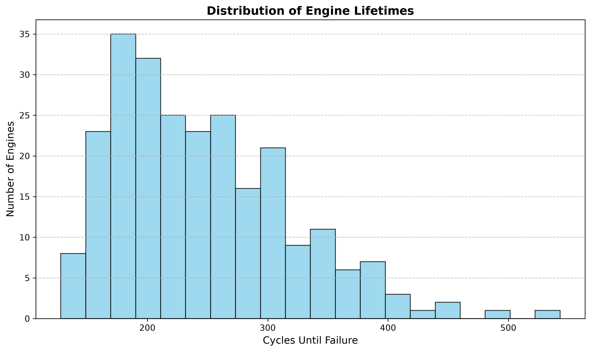
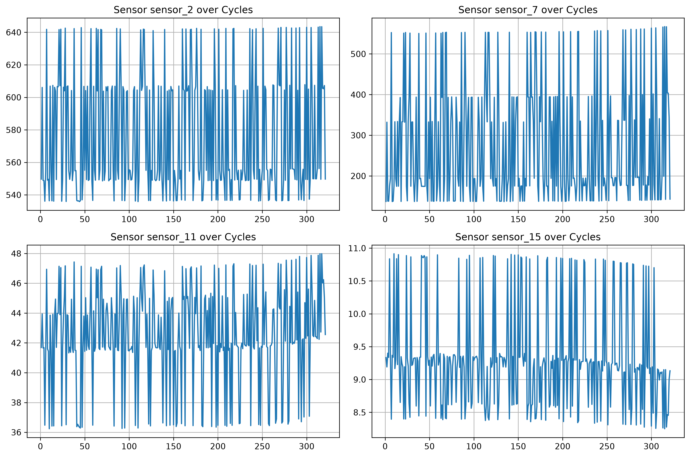
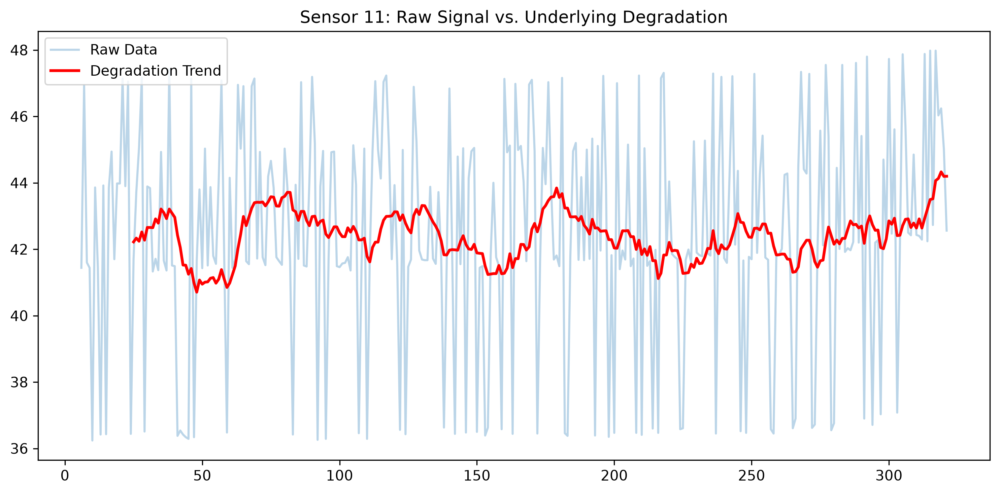
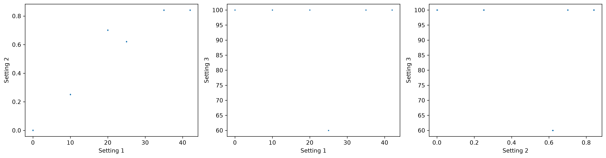
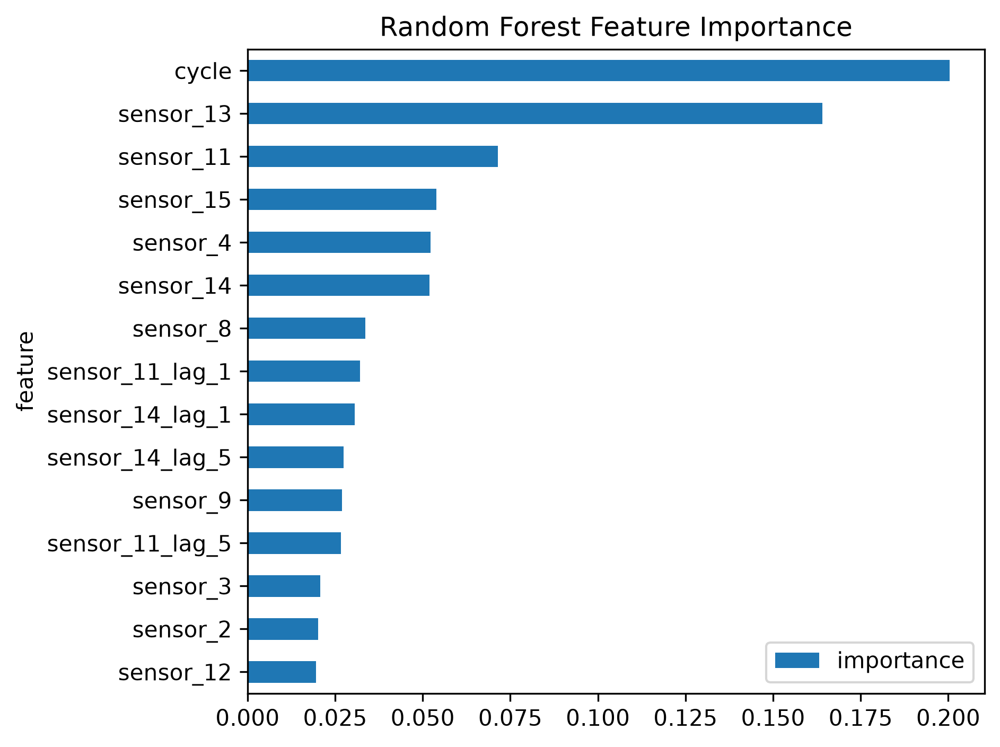
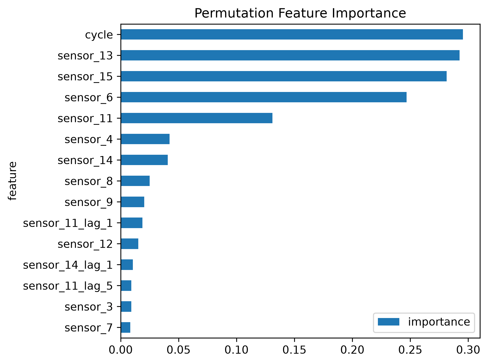
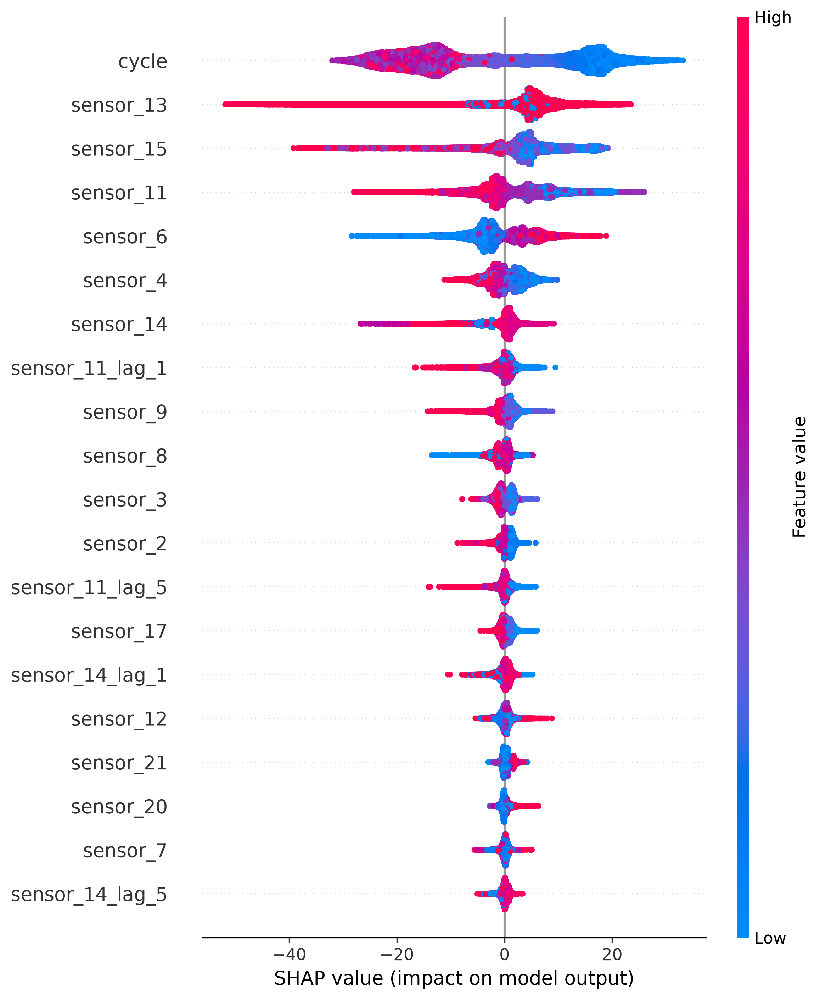
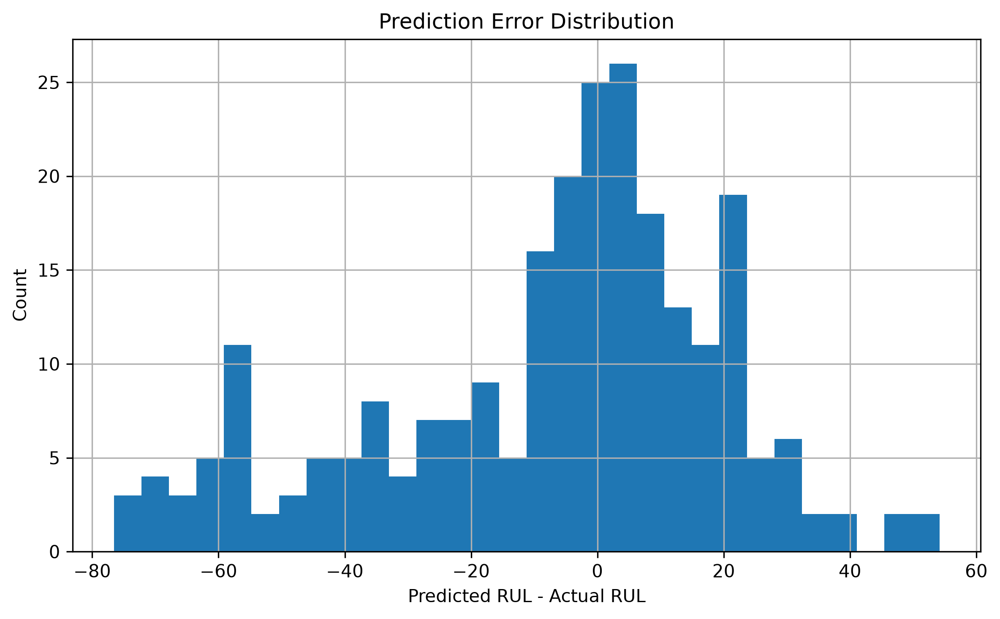

# Remaining Useful Life Prediction for Industrial Equipment (NASA CMAPSS FD004)

## Project Overview

This project develops an industrial machine learning pipeline for Remaining Useful Life (RUL) prediction using the NASA CMAPSS turbofan engine degradation dataset.

Unlike traditional predictive maintenance systems that only predict failure or no-failure, this project estimates the number of operating cycles remaining before an engine reaches failure conditions. Accurate RUL estimation allows maintenance teams to schedule repairs proactively, reduce downtime, optimize spare part logistics, and improve operational safety.

The project was developed as an end-to-end ML engineering project with an emphasis on industrial best practices, reproducibility, explainability, and deployment readiness.

---

## Business Motivation

Predicting RUL provides significantly more value than binary fault prediction because maintenance decisions require planning horizons rather than simple alarms.

### Underestimation of RUL

* Premature maintenance
* Increased operational cost
* Under-utilization of expensive assets

### Overestimation of RUL

* Unexpected failures
* Unplanned downtime
* Safety risks
* Expensive emergency maintenance

In safety-critical industries such as aviation, overestimation errors are significantly more costly than underestimation errors.

---

## Dataset

Dataset: NASA CMAPSS Turbofan Engine Degradation Simulation Dataset

Subset used:

* FD004

Characteristics:

* 249 training engines
* 248 testing engines
* Multiple operating conditions
* Multiple fault modes
* Variable degradation trajectories

FD004 is widely regarded as the most challenging subset due to regime switching and complex degradation behavior.

---

## Project Pipeline

### 1. Exploratory Data Analysis

* Engine lifetime distribution analysis
* Sensor variance analysis
* Degradation trend visualization
* Operating regime analysis

### 2. Feature Engineering

* RUL target generation
* RUL clipping at 125 cycles
* Rolling mean features
* Rolling standard deviation features
* Lag features
* Temporal delta features
* Operating regime clustering using KMeans

### 3. Validation Strategy

To prevent temporal leakage, GroupKFold cross-validation was performed using engine IDs as grouping variables.

This ensures the model is evaluated on completely unseen engines rather than unseen cycles from previously observed engines.

### 4. Models Evaluated

* Linear Regression
* Ridge Regression
* Gradient Boosting Regressor
* HistGradientBoosting Regressor
* Random Forest Regressor
* XGBoost Regressor

### 5. Hyperparameter Optimization

RandomizedSearchCV was used to optimize tree-based models while maintaining group-aware validation.

### 6. Explainability

Model interpretability was investigated using:

* Feature Importance
* Permutation Importance
* SHAP Values

---

## Final Holdout Results (Official NASA Test Set)

| Model         |       MAE |      RMSE |        R² | NASA Score |
| ------------- | --------: | --------: | --------: | ---------: |
| Random Forest |     21.60 |     29.18 |     0.714 |       6568 |
| XGBoost       | **21.23** | **28.65** | **0.724** |   **5734** |

The tuned XGBoost model achieved the best performance across all evaluation metrics and was selected as the final deployment candidate.

---

## Final Model

XGBoost Regressor

Hyperparameters:

* n_estimators = 300
* max_depth = 8
* learning_rate = 0.05
* subsample = 0.8
* colsample_bytree = 1.0
* min_child_weight = 5

---

## Repository Structure

```text
remaining-useful-life-prediction/
│
├── data/
├── figures/
├── models/
├── notebooks/
├── README.md
├── requirements.txt
└── .gitignore
```

---

## Saved Artifacts

* xgb_rul_model.pkl
* regime_kmeans.pkl
* feature_order.pkl

---

## Future Work

Potential improvements include:

* LSTM-based sequence models
* GRU architectures
* Transformer-based prognostics models
* Physics-informed machine learning
* Real-time deployment pipelines
* Online learning and adaptive maintenance scheduling

---

# Visualizations

## Project Workflow


The project follows a complete industrial machine learning workflow from business understanding and exploratory data analysis through feature engineering, model development, explainability, and deployment preparation.

---

## Engine Lifetime Distribution



The FD004 dataset contains engines with highly variable lifetimes ranging from approximately 130 to over 540 cycles, making Remaining Useful Life prediction significantly more challenging than fixed-lifetime systems.

---

## Sensor Degradation Examples



Several sensors exhibit clear degradation trends near failure, while others are dominated by operational noise and changing operating regimes.

---

## Sensor Trend Extraction



Rolling averages were used to extract the underlying degradation signal hidden beneath high-frequency operational noise.

---

## Operating Regimes



FD004 contains multiple operating regimes and fault modes. KMeans clustering was used to identify operating conditions and provide regime-aware features to the model.

---

## Feature Importance



Tree-based feature importance revealed that temporal degradation indicators and operating regime information contributed most strongly to model predictions.

---

## Permutation Importance



Permutation importance provided a more robust estimate of feature contribution by measuring performance degradation when individual features were shuffled.

---

## SHAP Explainability



SHAP analysis provided local and global interpretability, allowing investigation of how individual sensor measurements influenced predicted Remaining Useful Life values.

---

## Prediction Error Distribution



The prediction error distribution allows inspection of model bias and provides insight into whether the model tends to overestimate or underestimate remaining life.

For safety-critical systems such as aviation engines, slight underestimation is often preferable to overestimation due to the significantly higher cost of unexpected failures.


## Technologies Used

* Python
* NumPy
* Pandas
* Matplotlib
* Scikit-learn
* XGBoost
* SHAP
* Joblib

---

## Author

Sami Haider Mirza

Electrical Engineering Undergraduate with interests in Artificial Intelligence, Machine Learning Engineering, and Industrial AI Applications.
